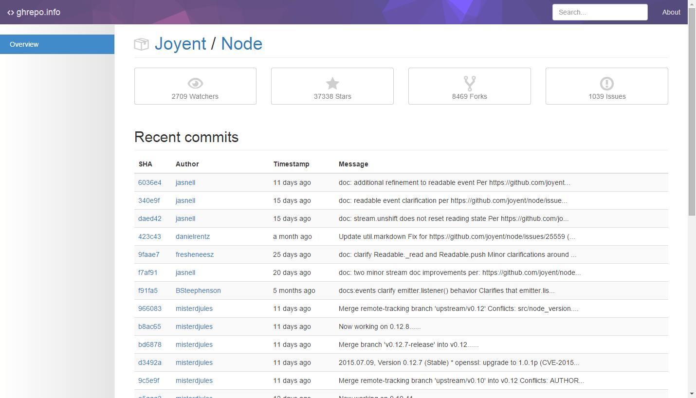

# ghrepo.info

A project inspired by [Picmonic/example-php-challenge](https://github.com/Picmonic/example-php-challenge). Queries the GitHub API to pull, store, and display repository information. Specifically the recent commits, for now. Created by @[C1V0](https://www.twitter.com/c1v0).

Preview the design live at [ghrepo.info](http://ghrepo.info).

### Resources

Review the original instructions for this challenge in [INSTRUCTIONS.md](INSTRUCTIONS.md).

A [Developer Notes](https://github.com/chrisvogt/example-php-challenge/wiki/Developer-Notes) wiki page has also been created to provide a technical summary.

### Screenshot

### License

[MIT License](LICENSE.md)

___

    
